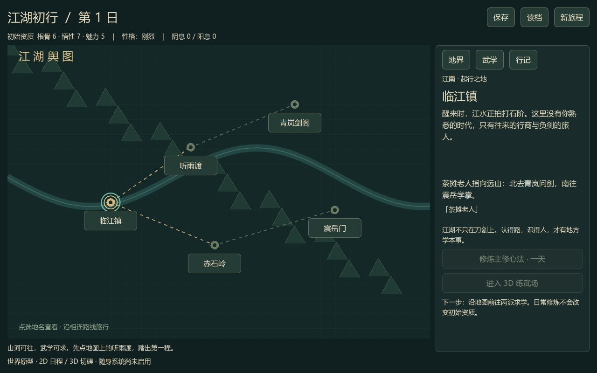
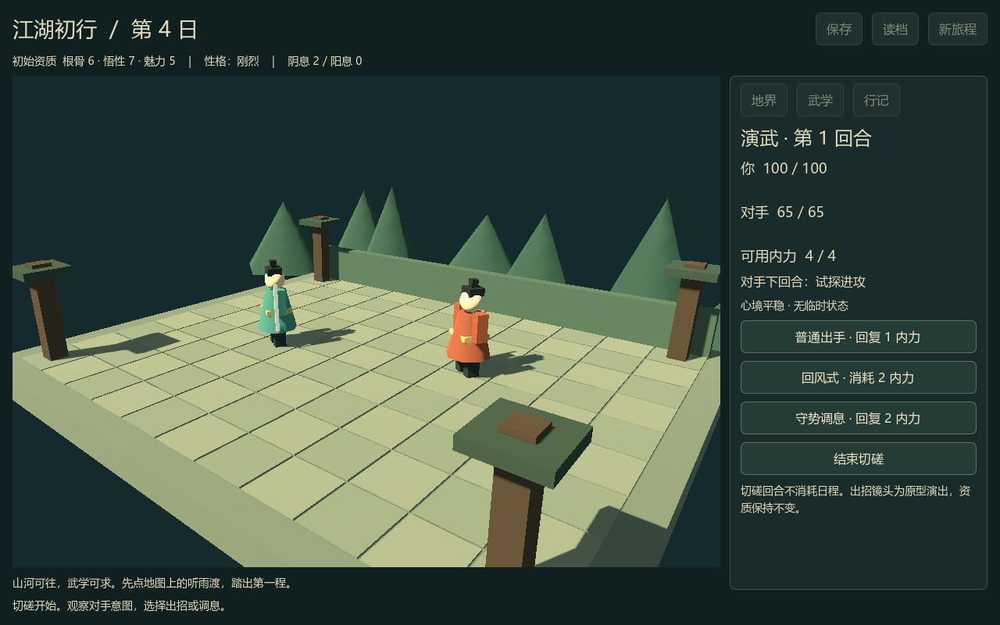

# 江湖初行 · GameFirst

一个正在制作的武侠游戏原型：**2D 大地图与按天修炼，3D 小场景回合切磋。**

主角穿越到武学时代，游历各地并向不同门派求学。人物以阴阳内力、所学招数、性格引发的临时状态构成战斗表现；根骨、悟性、魅力是通常固定的初始资质。随身系统能力尚未设计。

## 试玩当前版本

1. 使用 **Godot 4.7.2** 导入本仓库的 `project.godot`。
2. 按 **F5** 启动；默认场景已经配置，使用鼠标点击操作。
3. 在地图点选 **听雨渡 → 启程前往**，再前往 **青岚剑阁**。
4. 点击 **请教**，获得基础心法和回风式；**修炼主修心法**推进一天。
5. 点击 **入场切磋**，进入 3D 练武场。选择普通出手、招式或守势调息。
6. 返回地图，经听雨渡、临江镇、赤石岭前往 **震岳门**，学习阳性心法与崩岳掌。
7. 在 **武学** 页切换主修心法和招数；右上角手动保存或读档。

旅行每段路线推进一天；修炼一次推进一天。查看地点、切换武学及战斗回合不推进日程。初始资质不会因修炼或战斗上涨。




## 这一节点已实现

- 五处地点、相连路线与跨地界旅行；两派基础求学、两门心法和两式招数。
- 阴阳内息修炼、心法与招式适配、可切换的武学配置。
- 固定初始资质，以及刚烈性格受到挑衅时的短暂激愤：攻势提升、守势降低。
- 独立 3D 练武场、程序生成的低多边形角色、出招镜头和招式特效。
- 回合制切磋：招式消耗内力、普攻回复内力、防守减伤并调息，对手显示下回合意图。
- 胜负、结束切磋、返回地图、行记，以及本机手动存读档。

## 原型边界

这是第一段可玩闭环，尚不是完整游戏。两派目前均直接传授基础武学，未制作正式拜师、门派声望、剧情分支或稀有机缘。性格暂用刚烈，数值和地名均可调整。

3D 角色和招式为程序几何原型，尚无成品人物动画、美术、音效或实时弹反/QTE。借鉴《33号远征队》的独立战斗场景与出招镜头方向，不复刻其素材或全部机制。官方参考：[战斗介绍](https://www.expedition33.com/overview)。

当前提供 Godot 工程试玩，未生成独立 Windows 安装包；本机尚未发现匹配版本的导出模板。旧的 WASD 移动实验保留在 `main.tscn`，不是默认主场景。

存档位于 Godot 的 `user://first_journey_v1.json`，保存在本机，不上传 GitHub。没有自动存档；新旅程需确认，只有再次点击保存才覆盖磁盘进度。保存会保留上一份经过校验的备份；主存档损坏或丢失时可从备份恢复，并明确提示。若两份均不可用，读取失败会保留当前状态与原文件。

## 验证

```powershell
powershell -ExecutionPolicy Bypass -File tests/run_checks.ps1 -GodotPath "D:/Godot_v4.7.2-stable_win64_console.exe"
```

包括规则、回合战斗、真实界面信号流程和存档测试。界面流程测试使用独立测试存档，不接触玩家存档。渲染截图测试可使用 `--script res://tests/test_ui.gd -- --capture`，输出到已忽略的 `artifacts/`。

## 开发记录

- [世界框架](docs/superpowers/specs/2026-09-16-wuxia-world-framework.md)
- [首段旅程计划](docs/superpowers/plans/2026-09-16-first-journey.md)
- [进度与验证记录](docs/PROGRESS.md)

每个重要且验证完成的开发节点单独提交并上传 GitHub。保留源码与 UID，不上传 Godot 缓存、个人存档和本地测试产物。
